# 02 Basics

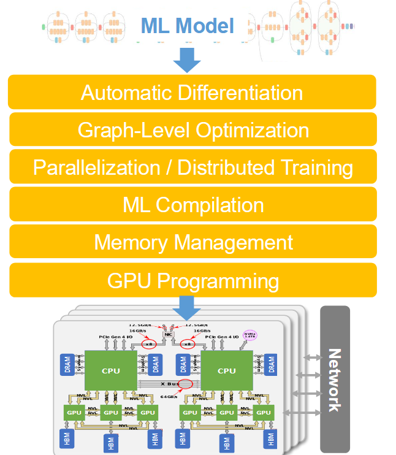

    用户定义模型结构（ML Model）
=>  通过自动微分（Auto Differentiation）把模型结构转化为计算图
=>  在计算图上做全局优化（Graph-Level Optimization）
=>  决定优化后的计算图在硬件上做划分和调度（Parrelization/Distributed Training）
=>  把高层算子编译成特定硬件上的底层代码，这里指使用 TVM/Triton 等编译器/DSL（ML Compilation）
=>  编译器负责运行时内存的管理和调度（Memory Management）
=>  硬件指令（GPU Programming）

## Graph-Level Optimization

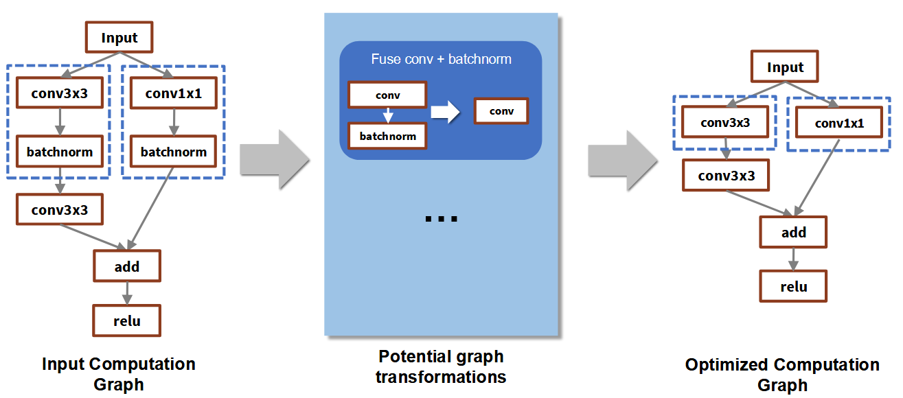

用 Batchnorm 和 Conv 的融合（Fusing）来说明图优化：

Batchnorm 的计算公式：

$$
y = \gamma \cdot \frac{x - \mu}{\sqrt{\sigma^2 + \epsilon}} + \beta
$$

在推理时，参数 $\mu$ 和 $\sigma^2$ 是常数，因此可以简化为为 $y = w \cdot x + b_{new}$ 这种格式：

$$
y = \frac{\gamma}{\sqrt{\sigma^2 + \epsilon}} \cdot x \;-\; \frac{\gamma \cdot \mu}{\sqrt{\sigma^2 + \epsilon}} + \beta
$$

假设卷积输出为 $x = W * z + b$：

$$
y = w \cdot (W * z + b) + b_{new} = (w \cdot W) * z + (w \cdot b + b_{new})
$$

通过这种方式，我们可以把 Batchnorm 的参数吸收进 Conv，从物理上删除了 Batchnorm 层。

另一个例子是融合两个卷积层：

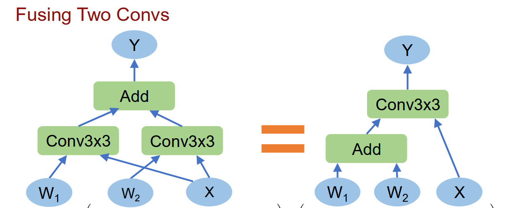

假设卷积层 1 的输出为 $x = W_1 * z + b_1$，卷积层 2 的输出为 $y = W_2 * x + b_2$，则可以将两个卷积层融合为一个卷积层：

$$
\begin{aligned}
y &= W_2 * h + b_2 \\
  &= W_2 * (W_1 * x + b_1) + b_2 \\
  &= (W_2 * W_1) * x + (W_2 * b_1 + b_2)
\end{aligned}
$$

## Parrelization/Distributed Training

考虑 SGD：

$$
w_i - \gamma \nabla L(w_i) \;=\; w_i - \frac{\gamma}{n} \sum_{j=1}^{n} \nabla L_j(w_i)
$$

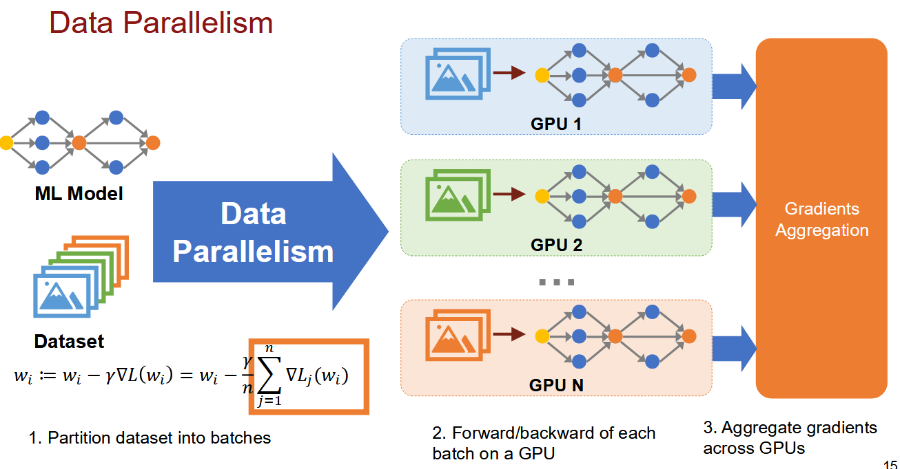

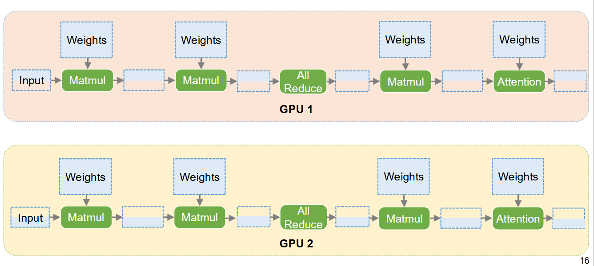

这里的数据并行（Data Parallelism）指：把一份完整模型复制到每张 GPU 上，把训练数据切成多块分给各张卡并行计算，最后把大家算出的梯度汇总平均，再同步更新所有卡上的模型。

由于公式里的求和具有线性可加性。假设有 4 张 GPU，把 n 个样本拆成 4 份，每份算出自己的局部梯度之和，最后再跨卡相加取平均，结果和单卡算全量的 batch 数学上是完全一致的。

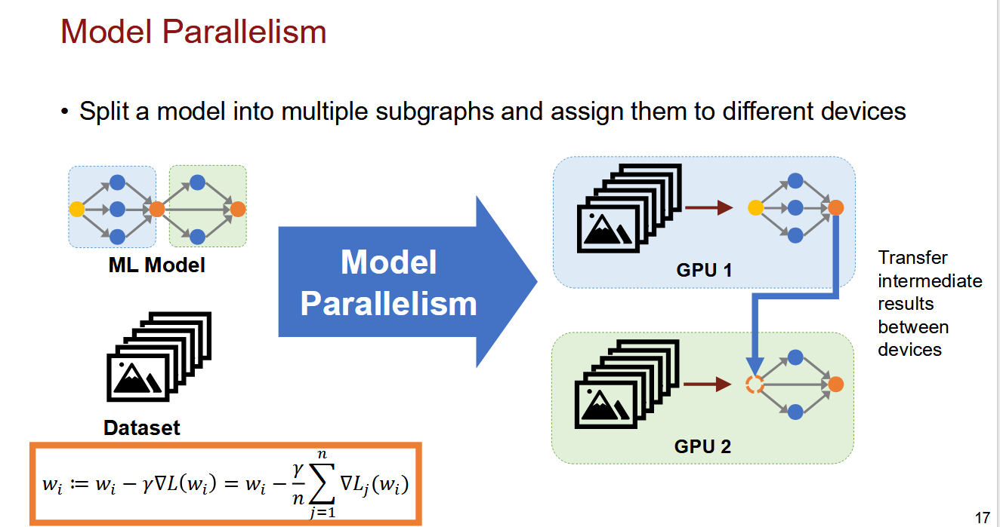

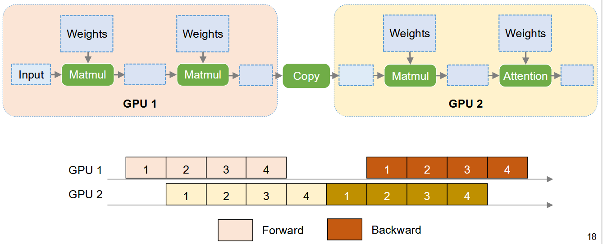

第一种模型并行（Model Parallelism）是在流水线意义下的。一块 GPU 负责模型的前半部分网络，另一块 GPU 负责模型的后半部分网络。每个 GPU 只算自己负责的那一段模型，前半部分算完后把输出传给后半部分继续算。

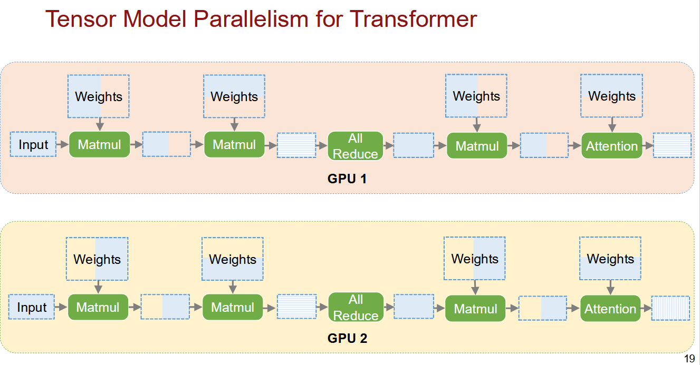

第二种模型并行（Model Parallelism）是把单层内的计算切分开。比如一个巨大的矩阵乘法（Matmul），把权重矩阵按列或按行切开，分别放到不同的 GPU 上。两张卡同时计算同一层的一部分，最后通过 AllReduce/Gather 拼回完整结果。

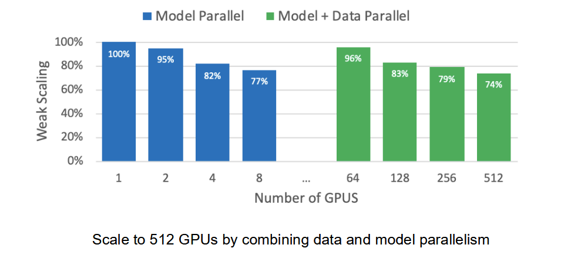

结合不同的并行化方法可以带来很高的收益。微软还提出了一个 3D Parallelism 的方法，把数据并行和两种维度的模型并行结合起来，进一步提高训练效率。

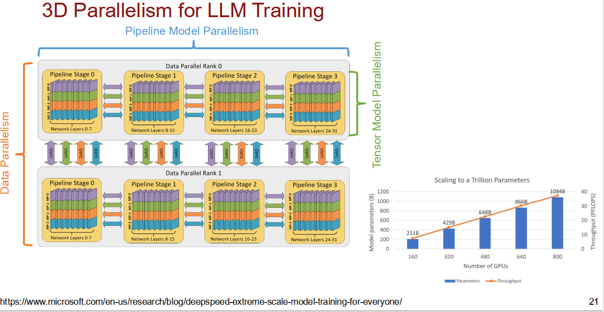

## ML Compilation

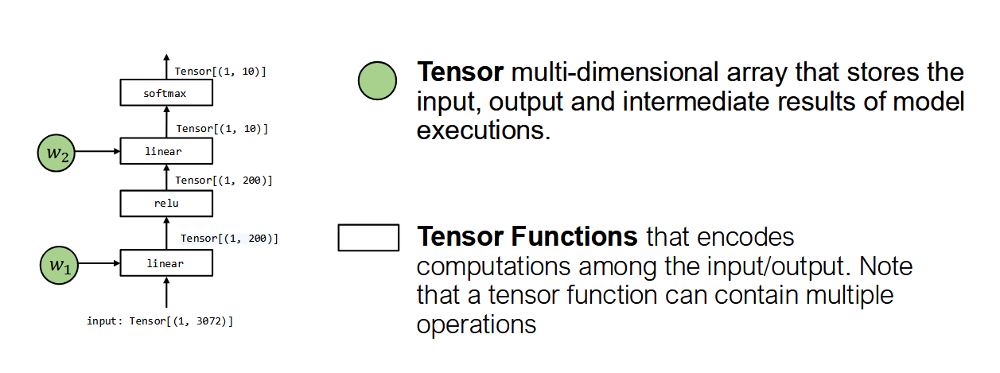

机器学习编译器（ML Compiler）的视角中的两个基本元素是：张量（Tensor）和张量函数（Tensor Function）。

ML Compilation 的基本目标包括：

1. 最小化内存占用；
2. 最小化执行时间；
3. 最大化硬件利用率。

怎么从高层的 Python 程序找到最适配硬件的底层实现呢？这就需要编译器做很多工作。

有一些手动的库（比如 cuDNN、MKL-DNN、OneDNN 等）提供了针对不同硬件的高性能实现，但这些库的接口是固定的，无法适配新的硬件。

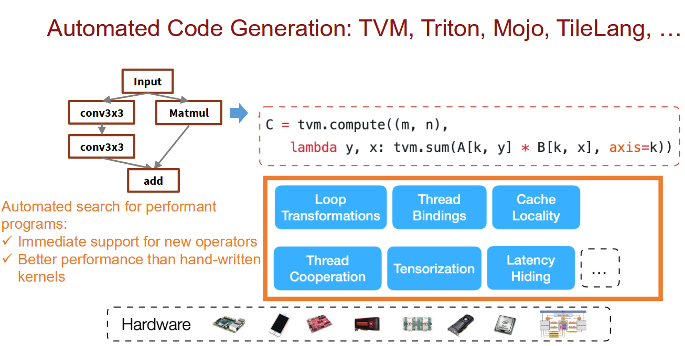

TVM 的 DSL 用纯数学方式定义了一个矩阵乘法的计算，橙色框里的六块代表实现同一份数学计算的无数种等价程序变换。最下面的各种芯片图标（CPU、GPU、NPU、FPGA 等）表示：同一份高层描述 + 同一份搜索逻辑，可以针对不同硬件目标生成代码。

## Memory

在 DNN 的训练中，GPU 内存是一个瓶颈。前向传播会生成大量中间结果。反向传播算梯度需要这些中间值，所以它们必须在显存里一直活到反向传播结束。模型越大、层数越多、batch size 越大，这些中间结果就越多。最终不是算力不够，而是显存放不下，导致模型训不了。

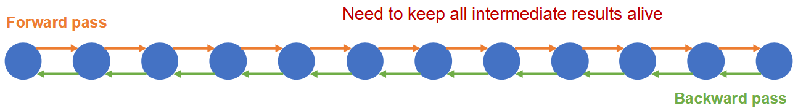

重计算（Recomputation）指：不把所有中间结果都存下来，只存“检查点”，反向传播到某个区间时，临时把缺失的中间结果重新算一遍。文档里用“彩色节点”代表检查点。假设模型计算图有 N 个节点：每隔 K 步存一个节点，只存 N/K 个检查点。反向时从最近的检查点开始，重新前向计算这 K 个节点，得到所需的中间值。

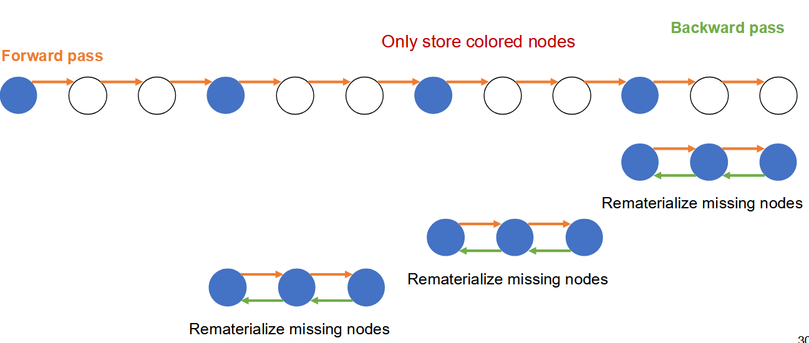

另一个关于内存的例子是分布式训练时产生的冗余问题（Zero Redundancy）。在数据并行时，每张卡都存一份完整的模型参数。实际上除了参数，还有梯度和优化器状态（比如 Adam 的一阶/二阶动量），这些也都复制在每卡上。Zero Redundancy 的想法是：把原本每卡都复制一份的参数、梯度、优化器状态切开，每张 GPU 只保管 1/N 的切片。当某张卡需要完整的参数做前向计算时，通过 broadcast 把各卡的切片收集起来；算完梯度后，也只更新自己负责的那片梯度。但是代价是通信开销增加了。

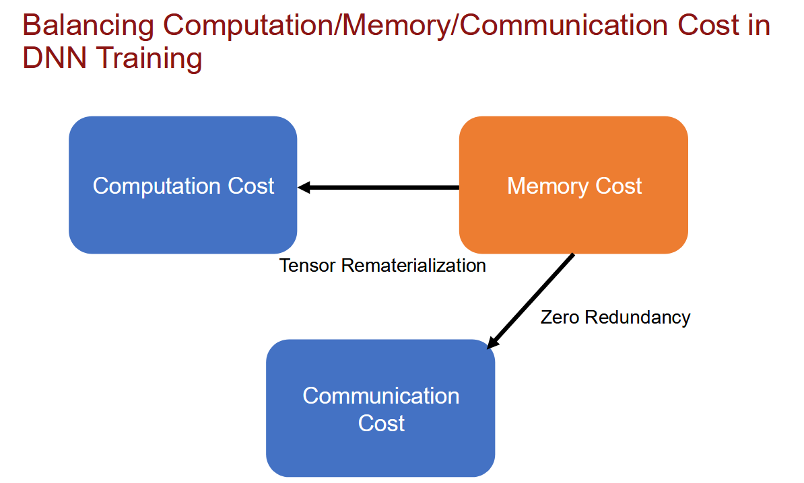

## PyTorch vs. TensorFlow

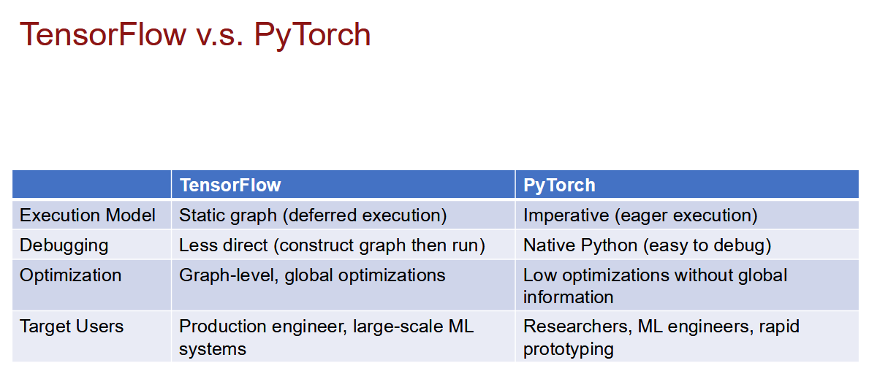

